# Multi app codebase setup - POC
This app consist of 3 app in one workspace and possible codes are reused using SPM and XCFramework.
Tech stacks: Swift, SwiftUI, XCProject, XCFramework, SPM, Xcode workspace

## Fructs

<table>
<td width="25%">
</img>
</td>
<td width="25%">
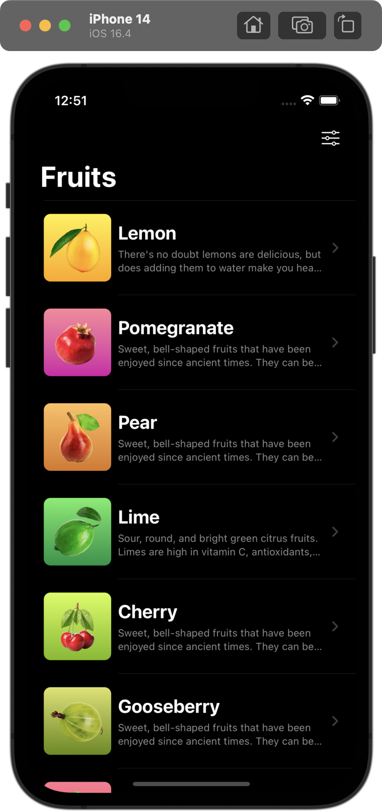</img>
</td>
<td width="25%">
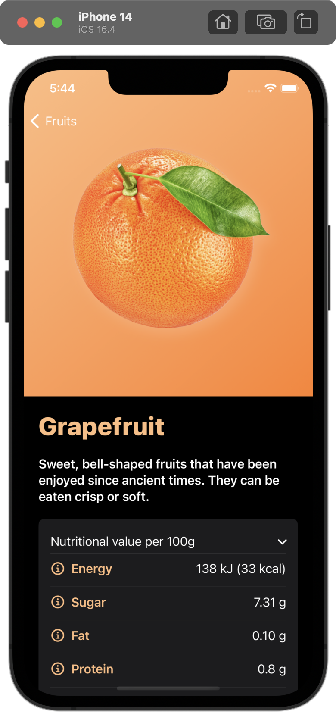</img>
</td>
<td width="25%">
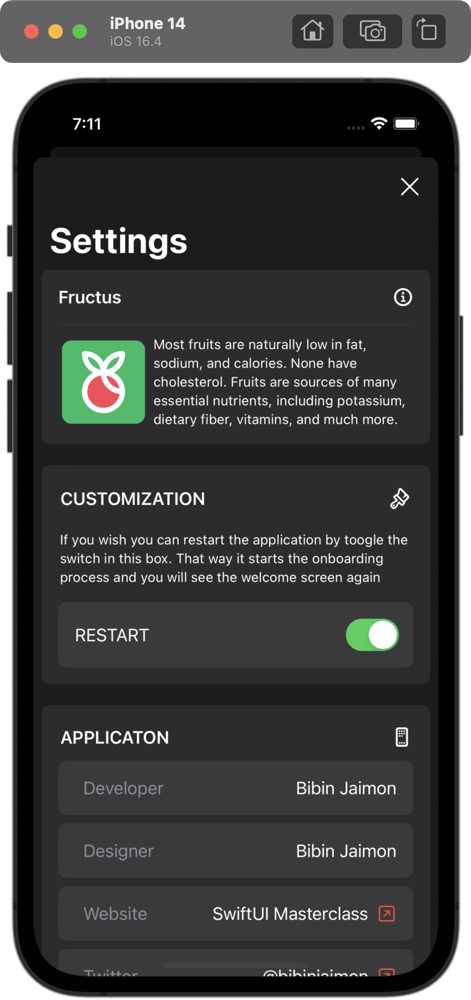</img>
</td>
</tr>
</table>

<table>
<td width="25%">
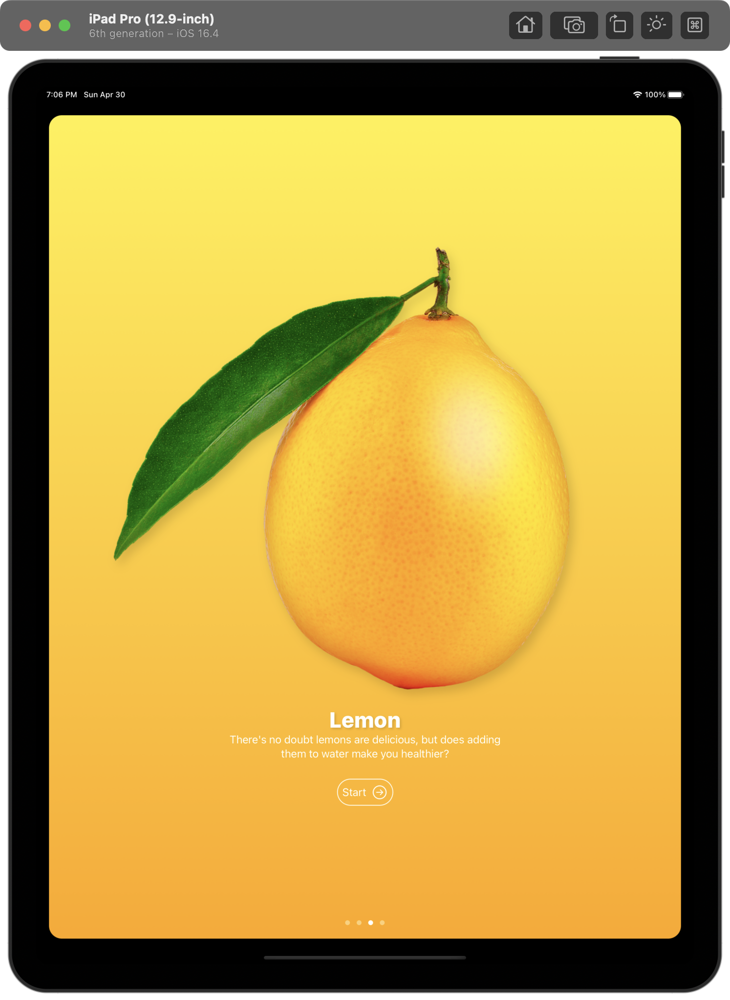</img>
</td>
<td width="25%">
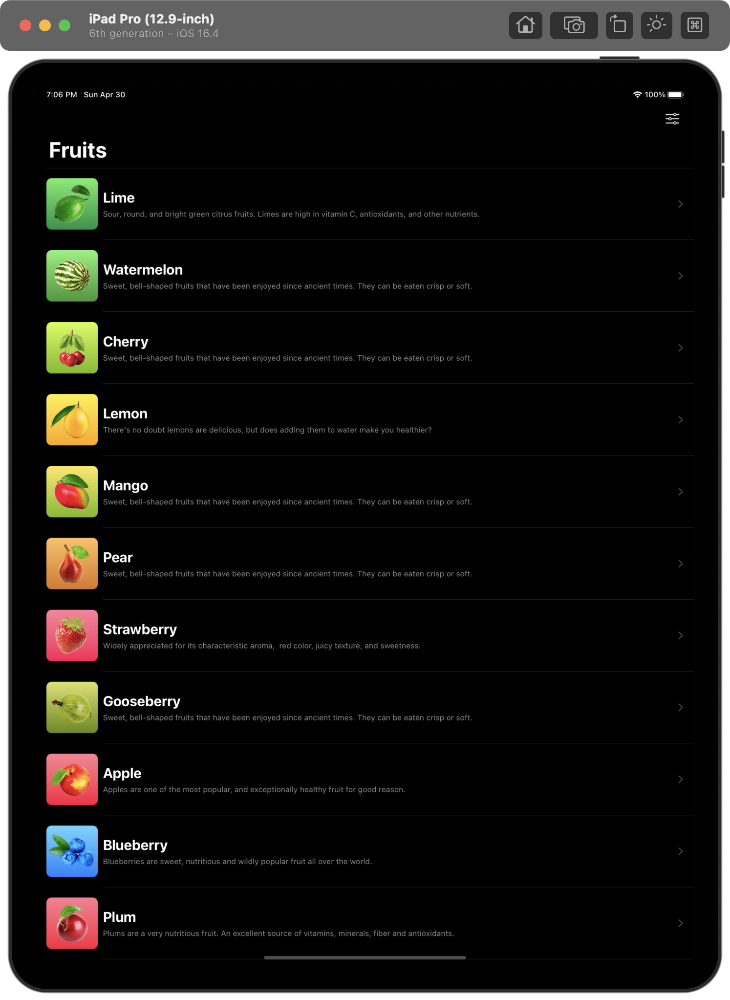</img>
</td>
<td width="25%">
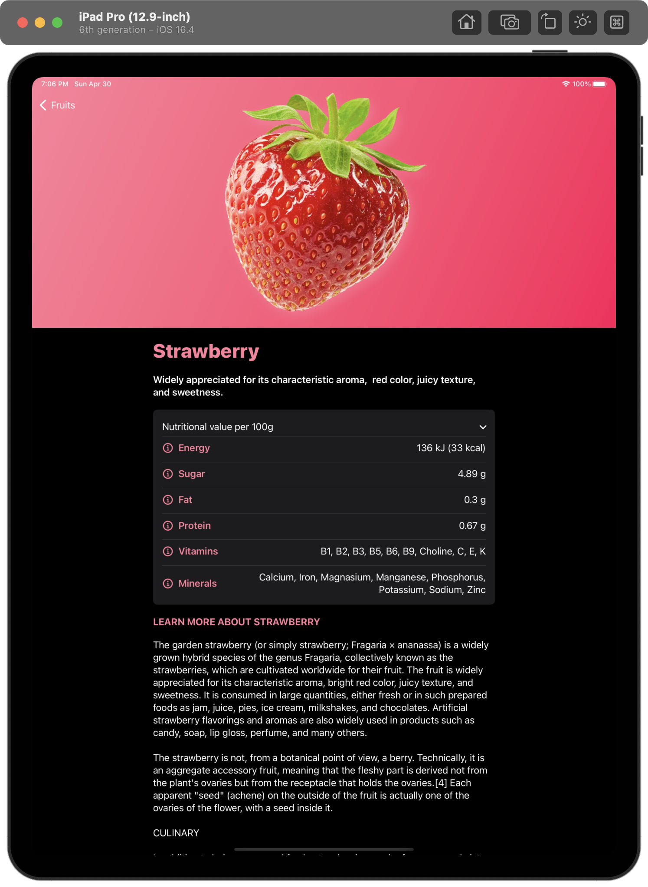</img>
</td>
<td width="25%">
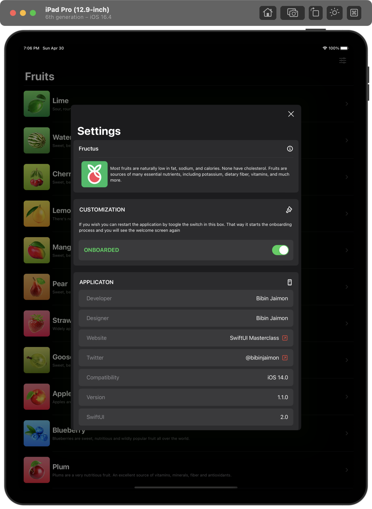</img>
</td>
</tr>
</table>

## Pinch App - SwiftUI

<table>
<td width="25%">
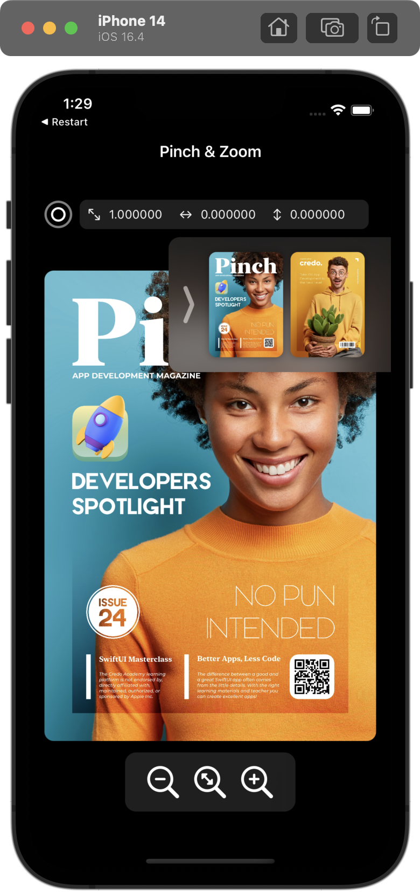</img>
</td>
<td width="25%">
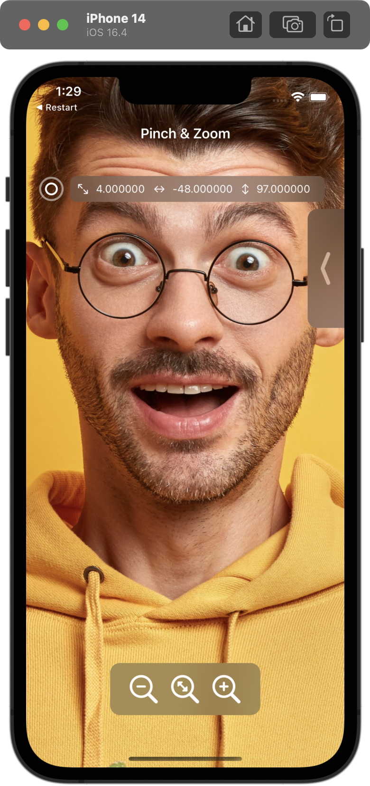</img>
</td>
<td width="25%">
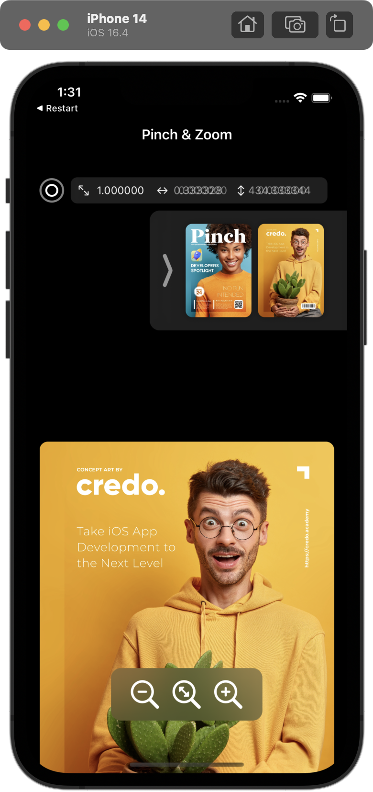</img>
</td>
<td width="25%">
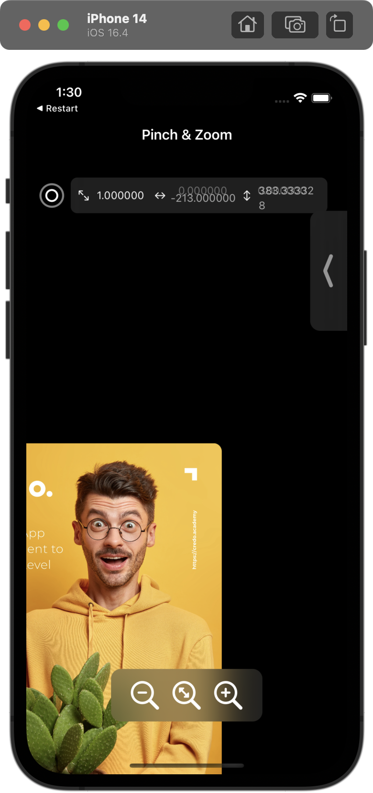</img>
</td>
</tr>
</table>

## Restart App - SwiftUI

<table>
<td width="25%">
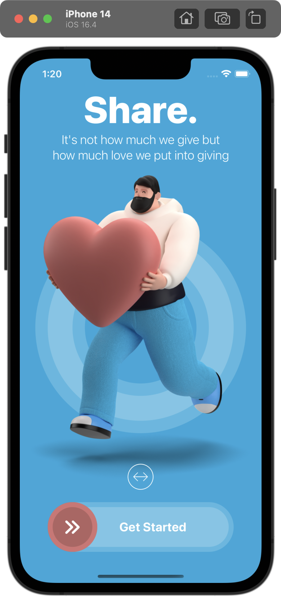</img>
</td>
<td width="25%">
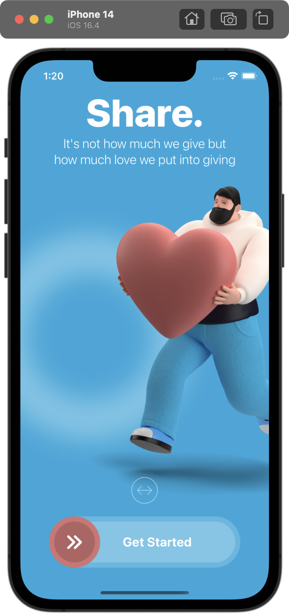</img>
</td>
<td width="25%">
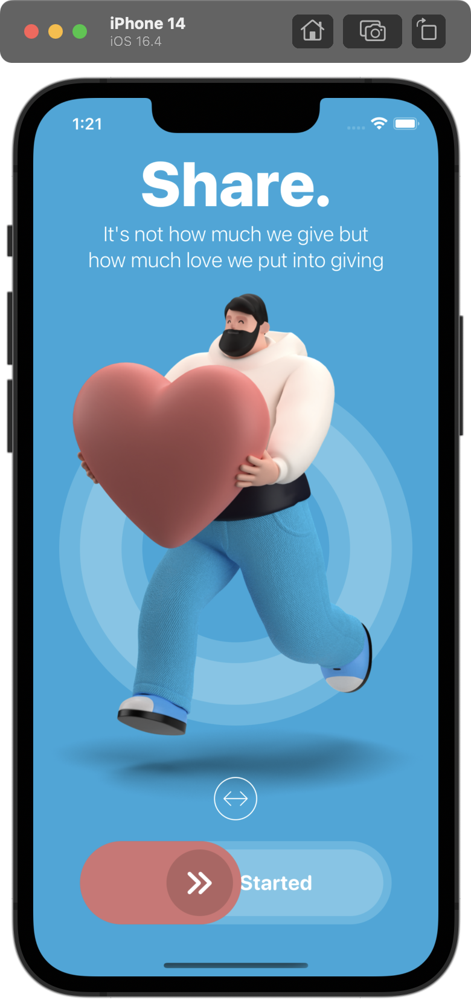</img>
</td>
<td width="25%">
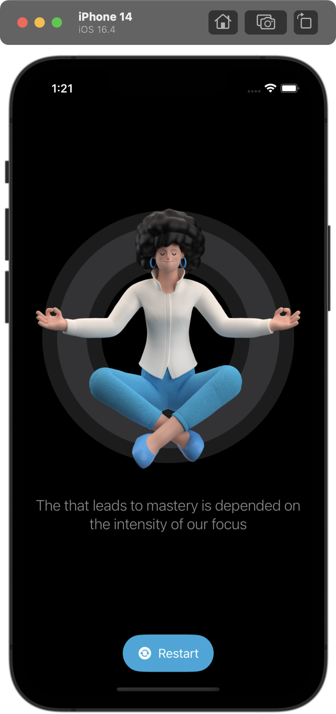</img>
</td>
</tr>
</table>
